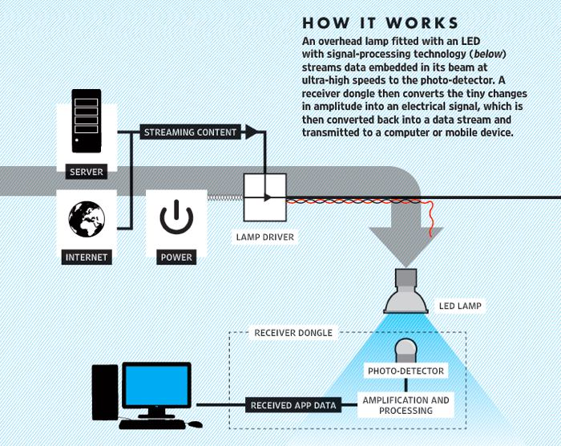
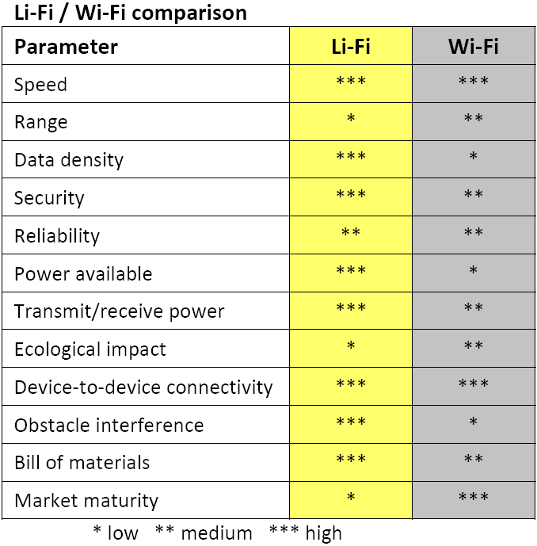

### Sinyal LIFI

## Sinyal Li-Fi
Lifi   merupakan   bentuk   komunikasi   cahaya   tampak   dan   bagian   darikomunikasi   nirkabel   optik   atau   biasa   disebut  optical wireless communications(OWC) dan bisa menjadi pelengkap komunikasi RF (wifi atau jaringan selular),atau bahkan pengganti di konteks penyiaran data.Pengembangan   dalam   peggunaan  light emitting dioda  (LED)   untukpenerangan   memberikan   kesempatan   untuk   menggabungkan   teknologi   lifi   kesejumlah lingkungan LED. Lifi sangat cocok untuk penggunaan jaringan internet,dengan berbagai konten aplikasi populer seperti video dan audio download, livestreaming,   dan   lain-lain.  Aplikasi   ini   membutuhkan   bandwidth   downlink   yangcukup  besar,  tetapi membutuhkan  kapasitas  uplink yang  minimum. Dengan inisebagian   besar   lalu   lintas   internet   off-load   dari   sinyal   RF   dapat   memperluaskapasitas seluler dan wifi.Lifi memiliki keunggulan yang berguna di daerah sensitif elektromagnetikseperti   di   kabin   pesawat,   rumah   sakit,   dan   pembangkit   listrik   tenaga   nuklir(PLTN)   tanpa   menyebabkan   interferensi   elektromagnetik.   Wifi   dan   lifimengirimkan  data  pada spektrum elektro  magnetik.   Namun  wifi menggunakangelonbang radio, sedangkan lifi menggunakan gelombang cahaya. sementara ituKomisi Komunikasi Federal AS telah memperingatkan krisi spektrum potensialkarena wifi telah  mendekati  over capacity. Lifi hampir  tidak  memiliki batasankapasitas.   Spektrum   pada   cahaya   adalah   10.000   kali   lebih   besar   dari   seluruhfrekuensi radio. [3]BG-Fi adalah sistem lifi yang terdiri dari aplikasi untuk perangkat mobile,dengan produk yang sederhana, seperti perangkat internet of things (IoT) dengansensor warna, mikrokontroller, dan perangkat lunak yang tertanam pada mobile.Cahaya  dari  layar   perangkat  mobile  berkomunikasi  dengan   sensor  warna  yangmengubah   cahaya   menjadi   informasi   digital.   Dioda   pemancar   cahayamemungkinkan   produk   konsumen   untuk   berkomunikasi   serentak   denganperangkat mobile.

 ## Pengaplikasian sinyal Li-Fi
 Lifi ini dapat di apliksikan pada perangkat apapun seperti berikut:Pada   RF   spektrum,   lifi   dapat   membantu   mengurangi   kapasitas   kelebihanjaringan   selular   yang   off-load   ke  jaringan.   Sehingga   dapat  sangat  efektif   padadownlink dimana kemacetan cenderung sering terjadi.
 pada smart lighting, setiap pencahayaan pribadi atau publik termasuk lampujalan dapat digunakan sebagai penyedia hotspot lifi dan komunikasi yang samadan infrastruktur sensor dapat digunakan untuk memantau kontrol pencahayaandan data.Pada konektivitas ponsel, laptop,  smart phone, tablet, dan perangkat mobilelainnya   dapat   melakukan   interkoneksi   langsung   menggunakan   lifi.   Denganberbagai link yang pendek memberikan kecepatan data yang sangat tinggi danjuga menyediakan keamanan.Pada lingkup yang berbahaya, lifi memberikan alternatif yang aman terhadapinterferensi elektromagnetik dari komunikasi frekuensi radio di lingkungan sepertitambang dan pabrik petrokimia.Pada   rumah   sakit   dan   healthcare,   lifi   tidak   akan   memancarkan   gangguanelektromagnetik   dan   tidak   mengganggu   peralatan   medis   dan   juga   tidak   akanterganggu oleh scanner MRI.Pada aviator pesawat, lifi dapat digunakan untuk mengurangi berat badan dankabel. Juga dapat menambah fleksibilitas pada kursi di kabin penumpang bagianlayout  pesawat,   dimana   lampu   LED   sudah   digunakan.   Sistem   In-flightEntertaiment  (IFE)   juga   dapat   terdukung   dan   terintegrasi   dengan   perangkatmobile penumpang itu sendiri.Pada   komunikasi   underwater,   karena   pada   komunikasi   underwatermembutuhkan penyerapan sinyal yang kuat di dalam air, penggunaan RF tidakpraktis.   Gelombang   akustik   memiliki   bandwidth   yang   sangat   rendah   danmengganggu kehidupan laut. Dna lifi memberikan solusi untuk komunikasi jarakpendek.Pada   kendaraan   dan   transportasi   umum,   lampu   LED   dan   lampu  tail-lightsedang   diperkenalkan.   Lampu   jalan,   signage   dan   sinyal   lalu   lintas   jugamenggunakan lampu LED. Dan ini dapat dugunakan untuk kendaraan-kendaraandi pinggir jalan untuk komunikasi.Untuk mengurangi penggunaan sinyal RF, beberapa orang mengklaim bahwamereka sangat peka terhadap frekuensi radio sehingga mencari alternatif lain, danlifi memberikan solusi atas masalah tersebut.Pada LBS (Location Based Service) lifi memberikan layanan informasi lokasiyang spesifik yang sangat akurat seperti navigasi yang memungkinkan penerimauntuk menerima informasi terkait yang sesuai pada waktu dan lokasi yang tepat.
 
 ## Cara kerja Li-Fi
 Teknologi OWC ini menggunakan cahaya dari dioda pemancar cahaya(LED)   sebagai   media   untuk   menyampaikan   jaringan   pada   ponsel.   Komunikasikecepatan   tinggi   seperti   menggunakan   komunikasi   dengan   wifi.   Komunikasicahaya atau  visible light communication (VLC) bekerja dengan beralih arus keLED off, dan pada tingkatan yang sangat tinggi, sehingga tidak dapat dilihat olehmata manusia karena terlalu cepat untuk dperhatikan. Meskipun lifi LED akanterus mengirimkan data, mereka bisa meredup dibawah visibilitas manusia saaatmasih   memancarkan     cahaya   yang   cukup   untuk   membawa   data.   Gelombangcahaya itu  tidak  dapat menembus  dinding sehingga membuat sinyal yang jauhmenjadi pendek. Meskipun lebih aman dari hacking, yang relatif terjadi pada wifi.Sambungan langsung dari sight tidak diperlukan unutk lifi dalam mengirimkansinyal, karena cahaya yang dipantulkan dari dinding dapat mencapai 70 Mbps.
 
 konduktor pada saat itu, akibat output optik, dapat diatur pada kecepatan yangsangat   tinggi   yang   dapat   dideteksi   oleh   perangkat   foto-detektor   dan   duibahkembali ke arus listrik. Modulasi intensitas tidak terlihat oleh mata manusia, dandengan demikian komunikasi sama bagusnya dengan sinyal RF. Sehingga denganteknik ini, informasi dapat di kirim dengan kecepatan tinggi dan dapat dikirimkanmelalui bola lampu LED.[3]Komunikasi   frekuensi   radio   membutuhkan   sirkuit   radio,   antena,   dankomponen penerima yang kompleks. Sedangkan lifi jauh lebih sederhana karenamenggunakan   metode   modulasi   langsung   mirip   seperti   yang   digunakan   dalampenggunaan sinyal lemah infra mera, perangkat komunikasi seperti unit  remotecontrol.   Komunikasi   infra   merah   terbatas   daam   kekuasaan   karena   persyaratankeselamatan   dan   kesehatan   mata,   sedangkan   lampu   LED   memiliki   intensitastinggi dan dapat mencapai kecepatan data yang sangat besar.
 #Fitur-fitur Li-FiKapasitas bandwidth spektrum cahaya 10.000 lebih dari spektrum RF, tanpahambatan, dan bebas dalam penggunaan. Densitas data lifi dapat mencapai sekitar1000 kali kepadatan data wifi karena cahaya juga terdapat pada daerah iluminasiketat   dan   terpusat   sedangkan   RF   cenderung   menyebar   dan   menyebabkangangguan.   Kecepatan   tinggi  dapat  dicapai  karena  gangguan   rendah,   bandwidthperangkat tinggi dan intensitas tinggi pada output optik. Perencanaan kapasitassederhana karena agak cenderung pada infrastruktur penerangan dimana orang-orang ingin berkomunikasi, dan kekuatan sinyal yang baik dapat dilihat.Efisiensi pada biaya rendah karena memerlukan komponen lebih sedikit dariteknologi   sinyal   radio.   Energi   dalam   pencahayaan   LED   sudah   efisien   dantransmisi   data   membutuhkan   daya   tambahan   yang   diabaikan.   Lingkungantransmisi pada RF dan propagasi sangat sulit, tetapi tidak pada lifi yang bekerjadengan baik dalam hal lingkungan.Keselamatan terhadap kehidupan di bumi telah berevolusi melalui paprancahaya,   sehingga   tidak     ada  masalah   keamanan   atau   kesehatan   pada   teknologiini.dan   tidak   ada   bahaya   yang   diakibatkan   oleh   teknologi   ini   karena   transmisicahaya menghindari penggunaan frekuensi radio yang dapat mengganggu sirkuitelektronik di lingkungan tertentu seperti di dalam pesawat.
 Keamanan dalam privasi sangat terjaga karena sulit dalam pencarian sinyaldi luar area karena sinyal terbatas pada daerah khusus dan tidak akan menembusdinding selain kaca. Pengendalian data dapat diarahkan dari satu perangakat keperangkat lain dan pengguna dapat melihat dimana data tersebut tersimpan. Tidakada fitur keamanan tambahan seperti pasangan dalam interkoneksi RF pada sinyalbluetooth.
 Dibawah ini adalah tabel perbandingan fitur Li-Fi dengan WiFi
  
 ## Opini
 Banyak   orang   mengaku   bahwa   teknologi   ini   adalah   ciptaannya,   sepertisebuah   perusahaan   di   Rusia   Stins   Coman   yang   mengumumkan   bahwa   telahmenciptakan lifi yang disebut dengan BeamCaster. Bahkan ciptaan tersebut telahdijual   di   AS,   Israel,   Tiongkok,   hingga   negara-negara   lainnya.     BeamCastertersebut   dapat   mentrasfer   informasi   ke   perangkat   elektronik   dengan   bantuancahaya. inti pada jaringan ini adalah sebuah router yang mampu mentransmisikansinyal dengan menggunakan pancaran cahaya pada jarak 7 hingga 8 meter. Sinyalini dapat ditransmisikan kedelapan alat sekaligus di berbagai bagian perusahaandan kecepatan aksesnya empat kali lebih tinggi dibanding wifi standar.[3]Menurut   para   pengembang   teknologi   tersebut, memiliki   beberapakeunggulan, termasuk mobilitas dan   kecepatan konfiguras.   
 Menurut Dairus Zaents, kepala kantor RiT Technologies Rusia, berpendapat bahwa penggunaanteknologi tersebut mudah digunakan, karena tinggal memasang modeltransmisinya di langit-langit, mengatur konfigurasi alat untuk menerima modulpada komputer kerja, dan kita akan mendapatkan jaringan aktif di kantor hanyadalam beberapa jam. Dan dapat dibongkar kembali dengan cepat jika diperlukan.Zaents salah satu pengembang teknologi tersebut juga menjelaskan bahwakecepatan maksimum yang mampu dicapai jaringan wifi adalah 300 Mbps untuksemua saluran, bukan untuk setiap pengguna yang terhubung.Salah satu perancang alat BeamCaster ini juga menekankan bahwaterobosan mereka jauh lebih aman dan ramah lingkungan daripada wifi karenasinyal wiif sangat mudah didapatkan. Sinyal itu dapat menmbus dinding, dan paraperetas dapat dengan mudah terhubung. Sedangkan alatnya hanya mentrasfer datamelalui pancaran sinar, jadi tidak mungkin mencegat atau menyadapnya. Selainitu sinyal radio yang digunakan wifi dapat mengganggu alata   elektronik   lain,misalnya peralatan medis tertentu. Pancaran cahaya ini tidak dipengaruhi medanelektromagnetik luar.Sukhmolinov juga menilai solusi ini sangat menarik dan menjanjikan,karena bisa menjadi alternatif wifi yang bagus bagi perusahaan-perusahaan besar.Selain itu, kecepatan pada   alat yang stasioner sangat tinggi dan jauh lebih terlindungi daripada sinyal radio atau kabel.Namun, para ahli juga ada yang meragukan masa depan proyek ini karenaalat ini   memiliki   banyak   kekurangan,   seperti   kesulitan   dalam   memposisikanreceiver,kesulitan dalam bekerja dengan perangkat mobile lainnya, dan biayaimplementasiyang relatif tinggi. Dan menurutnya prospek pasar unutuk alat inisekitar lima persen dari pasar yang dimiliki oleh wifi saat ini
